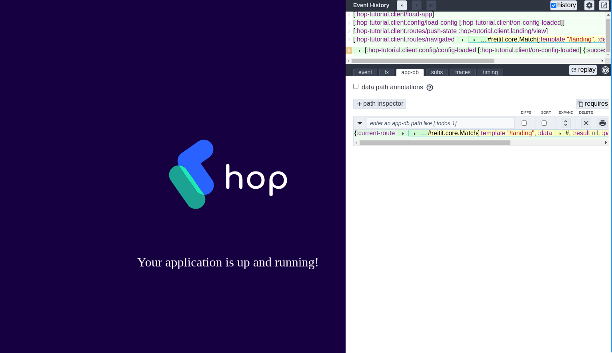
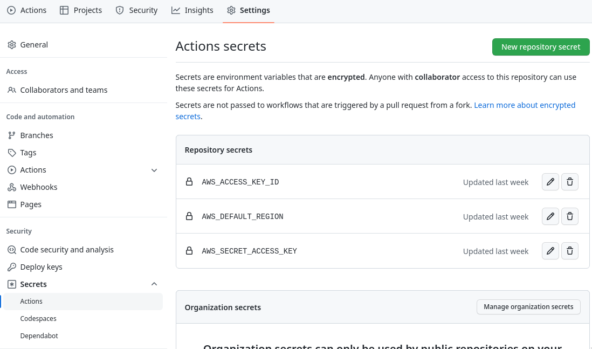
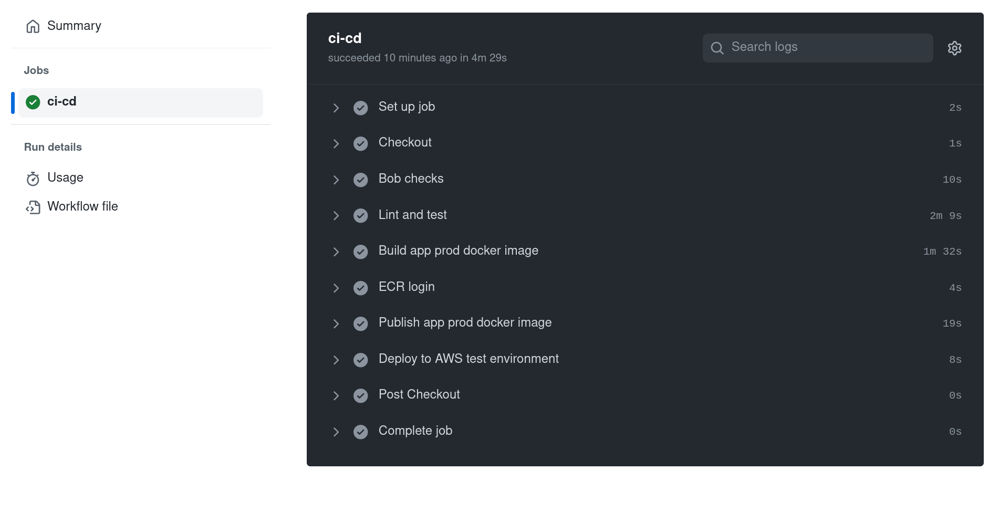
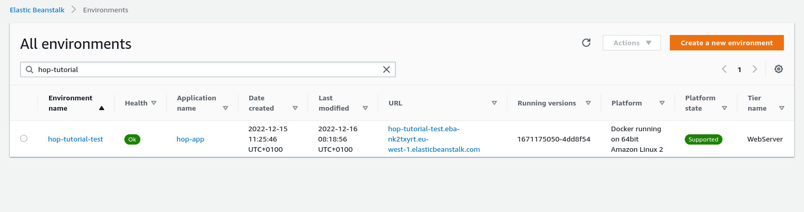
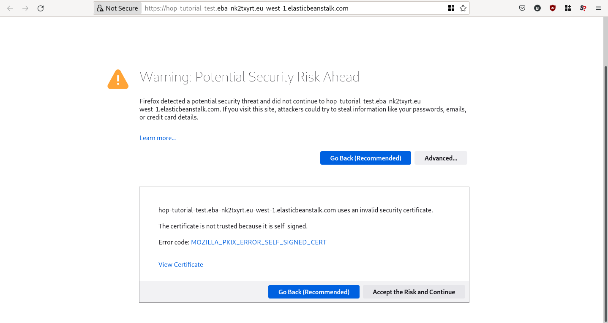
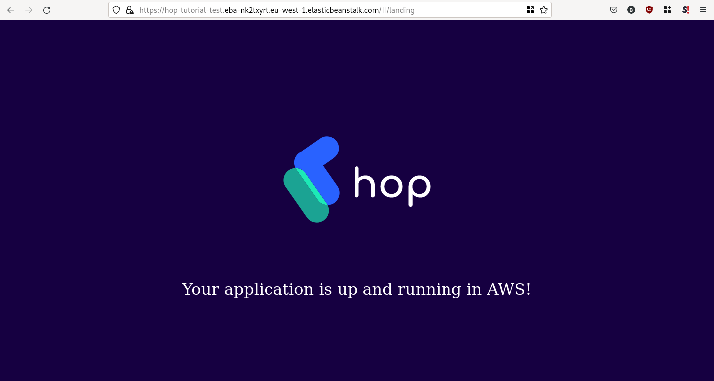

AWS run project
===============

Introduction
------------

In this tutorial you will bootstrap a basic HOP platform with the
following features:

* `Duct Framework`_ based backend.
* `Reactive`_ ClojureScript frontend.
* Infrastructure provisioning in the Amazon Web Services cloud provider.
* CI/CD integration with `Github Actions`_.

.. _Reactive: https://github.com/reagent-project/reagent
.. _Duct Framework: https://github.com/duct-framework/duct
.. _Amazon Web Services: https://aws.amazon.com/
.. _Github Actions: https://docs.github.com/en/actions

.. note::

   The HOP platform provides more bootstraping features, but this
   tutorial will focus in a bare minimum installation.

The tutorial is also available on video:

.. raw:: html

    

        <iframe width="560" height="315" src="https://www.youtube.com/embed/x1g9Pr6kSJU" title="YouTube video player" frameborder="0" allow="accelerometer; autoplay; clipboard-write; encrypted-media; gyroscope; picture-in-picture" allowfullscreen></iframe>
    

Prerequisites
-------------

Having the HOP Command Line Tool installed as explained in the
:doc:`/get-started/installation/main` tutorial is enough for
bootstraping a new HOP project. But for running the generated project
locally you will need some additional tools:

* `Docker <https://www.docker.com/>`_
* `Docker Compose <https://docs.docker.com/compose/>`_
* `AWS Vault <https://github.com/99designs/aws-vault>`_

Apart from the software requirements, you will also need an Amazon Web
Services account with admin credentials in order to create the needed
infrastructure.

Install Docker
++++++++++++++

To install, please refer to the `Docker documentation`_ to install it
on your OS of choice.

.. _Docker documentation: https://docs.docker.com/engine/install/

Once you have installed Docker, you can check that it's installed
correctly by running:

.. code-block:: console

   $: docker run --rm hello-world

Install Docker Compose
++++++++++++++++++++++

To install, please refer to the `Docker Compose documentation`_ to
install it on your OS of choice.

.. _Docker Compose documentation: https://docs.docker.com/compose/install/

Once you have installed Docker Compose, you can check that it's installed
correctly by running:

.. code-block:: console

   $: docker-compose --version
   docker-compose version 1.27.4, build unknown

For running HOP Docker Compose version 1.27.0+ is required.

Install AWS Vault
+++++++++++++++++

To install, please refer to the `AWS Vault documentation`_ to install
it in your OS of choice.

.. _AWS Vault documentation: https://github.com/99designs/aws-vault#installing

Once you have installed AWS Vault, you can check that it's installed
correctly by running:

.. code-block:: console

   $: aws-vault --version
   v6.0.0

No specific version is required, but latest is recommended.

Prepare AWS credentials
-------------

The HOP bootstrap tool will automatically provision the needed
infrastructure to run the HOP platform using `AWS Cloudformation`_. In
order to run that you will need a pre-created Amazon Web Services
account and administrator credentials.

Although it's not mandatory, we strongly recommend to store the
administrator credentials using AWS Vault. The tool provides secure
storage for AWS credentials for the local development environment. The
tool is also used in later steps for running the project locally,

The tool will ask you for an AWS Access Key Id and its corresponding
AWS Secret Access Key. If you don't have the credentials, you can
`create them`_ from the AWS Console.

.. _AWS Cloudformation: https://aws.amazon.com/cloudformation/
.. _create them: https://docs.aws.amazon.com/IAM/latest/UserGuide/id_credentials_access-keys.html?icmpid=docs_iam_console

Once you have the credentials you can store them using the following
command:

.. code-block:: console

   $: aws-vault add hop/admin

The tool will ask you for the AWS Access Key ID and AWS Secret Access
Key, and the setup will be done.

Obtain the default settings file
--------------------------------

The HOP Bootstraping tool allows the user to configure certain
characteristics of the project to be generated and provisioned in
AWS. At the moment that configuration is specified using a
``settings.edn`` file that has to be edited manually.

The settings file is not intended to be written from scratch, but the
user has to edit the default file provided by the tool. To obtain that
file you can run the following command:

.. code-block:: console

   $: bb hop-cli.jar bootstrap copy-settings --settings-file-path settings.edn

The command will create an `edn` file in the current directory.

.. note::

   The ``settings.edn`` file might look a bit intimidating, but it's
   due to the fact that it's intended for being consumed by an user
   interface that will come in a future version of HOP. The file
   length is an effect of containing lots of pre-configured choices,
   that might not be needed by the user.

Edit the settings file
----------------------

The settings file allows configuring multiple features and
characteristics of the platform. For this tutorial we will only edit a
few of them.

The file has a tree-like structure in which each node has the
following fields:

* ``name``: The name of the node.
* ``tag``: Optional string explaining the node's purpose.
* ``type``: The type that the ``value`` field is of. The node can be a
  leaf (string, number, password...) or a branch (plain-group,
  single-choice-group and multiple-choice-group).
* ``value``: The configured value of the node.
* ``choices``: If the node is of type ``single-choice-group`` or
  ``multiple-choice-group`` this will contain a list of branches that
  the user can select. The selection is done using the ``value`` field
  by specifying the name(s) of the selected branch(es).

.. code:: Clojure

   [{:name :root-node
     :tag "Root node"
     :type :plain-group
     :value [{:name :node-1
              :tag "Node 1"
              :type :single-choice
              :value :opt-1
              :choices [{:name :opt-1
                         :tag "Opt 1"
                         :type :string
                         :value "opt 1 value"}
                         {:name :opt-2
                         :tag "Opt 2"
                         :type :string
                         :value "opt 2 value"}]}
              {:name :node-2
               :tag "Node 2"
               :type :multiple-choice
               :value [:opt-1 :opt-2]
               :choices [{:name :opt-1
                         :tag "Opt 1"
                         :type :integer
                         :value 1}
                         {:name :opt-2
                         :tag "Opt 2"
                         :type :integer
                         :value 2}]}]}]

In order to navigate the data structure above we will use the
following notation:

* node-1 -> ... -> node-n.property

For example if we want to reference the value of ``node-1`` we would
use the following:

* ``root-node`` -> ``node-1.value``

Having that structure and notation in mind, open the file with your
favorite text editor and edit the following options:

* ``project`` -> ``name.value``: We will set the project name to ``"hop-tutorial"``.
* ``project`` -> ``profiles.value``: HOP offers multiple profiles that
  enhance the bootstrapped project. But for this tutorial we will
  select some basic ones. We will set the value to ``[:core :frontend
  :aws :ci]``
* ``cloud-provider`` -> ``aws`` -> ``account`` -> ``region.value``:
  The AWS region you want to create the project resources in. Change
  to your desired region. As of now, the HOP Bootstrapping Tool was
  tested on ``eu-west-1`` AWS region. So we recommend you to use that
  region in order to ensure that all the services required by the HOP
  Bootstrapping Tool will be available.

.. note::

   If this is the second time you are following this tutorial or if
   you already have an existing AWS account, please refer to
   :doc:`/get-started/aws-run-project/appendix/existing-aws-account-settings`
   document for further considerations.

Run the bootstrap command
-------------------------

Once you are happy with the selected configuration you can bootstrap
the project by running the following command:

.. code-block:: console

   $: aws-vault exec -n hop/admin -- bb hop-cli.jar bootstrap new-project --settings-file-path settings.edn --target-project-dir hop-tutorial

Note that you are telling ``aws-vault`` to run the ``bb hop-cli.jar
bootstrap`` command with the ``hop/admin`` credentials that you stored
in the vault in a previous step.

Bootstrapping the project will take several minutes (mostly because of
the AWS provisioning). The tool will keep you informed about each step
that it performs:

* AWS infrastructure provisioning.

  * Account resources: Creates AWS resources that can be shared
    between multiple HOP projects.
  * Project resources: Creates AWS resources that will be shared
    between the different environments inside the ``hop-tutorial``
    project.
  * Dev environment resources: Creates the AWS resources needed for
    local development.
  * Test environment resources: Creates the AWS
    resources for running the test environment.

* Project files creation: Creates the local project files in the
  ``hop-tutorial`` folder.

* Post-installation steps: If required the tool will print additional
  manual steps that have to be performed after the bootstrap has been
  completed.

Configure the local project credentials
---------------------------------------

Certain operations of the bootstrap process can't be easily and
securely automated. So the tool will print the missing steps that have
to be performed manually. It's important not to lose the output of the
bootstrap execution until you have performed all the post-installation
steps or saved them in a secure place.

The prints include all the details about what to do, but we will
describe them here too. Nevertheless, you will still need to pay
attention to the output to get the needed credentials/secrets
generated by the bootstrap process.

First you will have to add the credentials for the AWS user used for
local development. The user will be shared among all the HOP projects
you run on your system. So this step will only have to be performed
the first time you bootstrap a HOP project.

.. code-block:: console

   $: aws-vault add hop/hop-local-dev

Then you will have to configure the role used for running the
``hop-tutorial`` project. That role contains the specific permissions
for interacting with the resources in the dev environment for the
``hop-tutorial`` project. You will have to edit the ``~/.aws/config``
file and add the rows printed by the HOP Boostrapping tool. It should
look like the following:

.. code-block:: python

   # Example configuration
   [profile hop/hop-tutorial-dev-env]
   source_profile=hop/hop-local-dev
   role_arn=arn:aws:iam::XXXXXXXXXX:role/hop-tutorial-dev-role
   region=eu-west-1

The tool will also print the AWS Access Key ID and AWS Secret Access
Key for the CI/CD user. Take note of them, as you will need them in a
next step to configure Github Actions.

Initialize the Git repository
-----------------------------

Before you make any change to the code we suggest to initialize the
git repository. That way you will easily track any changes that you
make to the code generated by the bootstrap.

.. code-block:: console

   $: cd hop-tutorial
   $: git init --initial-branch=main

.. note::

   As you can see we are setting the ``--initial-branch`` option to
   ``main``, which is the default value in the ``settings.edn``. This
   branch will be used as the deployment branch by the Continuous
   Delivery pipeline. So, it is important that the branch name aligns
   with the one configured in the ``settings.edn`` file. In any case,
   this setting is configurable and you can set to any other desired
   value in the ``settings.edn``.

And also make the initial commit:

.. code-block:: console

   $: git add .
   $: git commit -m "Initial commit"

Run the project in the development environment
----------------------------------------------

At this point you are ready to run the project in the development
environment. For that, simply run the ``start-dev.sh`` script. In
short, the script will take care of three things:

* Selecting the relevant `docker-compose` files used in the
  development environment and starting the Docker containers.
* Making sure that the environment is started in a fresh state.
* Running the project with the ``hop/hop-tutorial-dev-env``
  credentials needed for accessing the development environment
  resources.

.. code-block:: console

   $: ./start-dev.sh

You can see that the script started two Docker containers: the HOP web
application and a `Nginx`_ reverse proxy.

.. _Nginx: https://nginx.org

The application's container is already running, but that doesn't mean
that the application's web server is up and running. You need to start
it manually from the REPL. In the application logs you should see that
the REPL is running on the port ``4001``.

Using your favourite Clojure IDE connect to the REPL. Some IDE's call
this type of REPL external or remote.

Once connected, you can load up the Duct development environment:

.. code-block:: clojure

   user=> (dev)
   :loaded
   dev=>

And then start the application itself:

.. code-block:: clojure

   dev=> (go)
   :duct.server.http.jetty/starting-server {:port 3000}
   :initiated

At this point the application's web server will be up and running, and
you should be able to connect through a web browser. The ``(go)``
command outputed that the server is running on port ``3000``. But you
should connect through the Nginx reverse proxy that's running in the
port ``80`` instead.

Open a web browser and go to ``http://localhost``. You should see
HOP's welcome page there.

We won't make any change to the code now, so once you check that the
application is running you can stop it by executing the following
script:

.. code-block:: console

   $: ./stop-dev.sh

Create and configure the external Github repository
---------------------------------------------------

In this tutorial we will use Github for hosting the code, and Github
Actions for the Continuous Integration and Continuous Delivery
pipeline. Both services are free of charge for public repositories.

You can follow Github's `official documentation`_ for creating the
repository.

Once you create the repository, GitHub will display a set of
instructions to do your first commit and push. However, ignore it, and
only configure the secrets used for deploying the HOP application to
AWS by following these steps:

1. Open the repository settings.
2. In the sidebar, go to Security -> Secrets -> Actions.
3. You will need to configure three secrets here with the values of
   the CI user provided in the post installation steps of the
   bootstrap process.

   * ``AWS_ACCESS_KEY_ID``
   * ``AWS_SECRET_ACCESS_KEY``
   * ``AWS_DEFAULT_REGION``

Then configure the local repository to point to Github's
remote repository by running:

.. code-block:: console

   $: git remote add origin <github-repository-url>

And you can push your initial commit:

.. code-block:: console

   $: git push -u origin main

.. _official documentation: https://docs.github.com/en/repositories/creating-and-managing-repositories/creating-a-new-repository

Deploy application to test environment
--------------------------------------

The first push to the repository won't trigger the pipeline, so you
will have to make a second commit to proceed.

Open the ``app/src/hop_tutorial/client/landing.cljs`` namespace using
your favorite IDE and edit the ``"Your application is up and
running"`` message to ``"Your application is up and running on AWS"!!!!!!``.

Now commit and push the change to Github:

.. code-block:: console

   $: git add app/src/hop-tutorial/client/landing.cljs
   $: git commit -m "Change landing message"
   $: git push

This second commit will start the pipeline which will perform the
following steps:

1. Linting and format checks of the ``sh``, ``yaml``, ``json`` and
   ``Dockerfile`` files.
2. Linting and format checks of the Clojure project files using
   ``clj-kondo``, ``eastwood`` and ``cljfmt``.
3. Executing tests.
4. Deploying The application to AWS ElasticBeanstalk. For that the
   Docker production image is built and uploaded to AWS ECR first.

At this point the application should be deployed to AWS. You can check
that the deployment was successfull in the AWS Console:

Log in into your AWS Account and go to the ElasticBeanstalk service.

Now choose the ``hop-tutorial-test`` environment under the ``hop-tutorial``
application.

.. image:: img/elasticbeanstalk-environment.png

If the deployment was succesfull you will see a green check in the
Health section. It might happen that when you open the page the
application is still being deployed. So don't worry if you see a red
or yellow health check for some time. If something goes wrong the
errors will be displayed in the "Recent events" section below the
health check.

Accessing the web application in the test environment
-----------------------------------------------------

Under the ElasticBeanstalk environment name you will see the
application's publicly available URL.

When accessing it for the first time you will get a warning about the
page certificate being invalid. That's expected as the application is
using a self-signed certificate created by the Bootstrap tool.

You can tell the browser to ignore the warning until you setup a real
certificate.

There you have your new HOP-based application!
