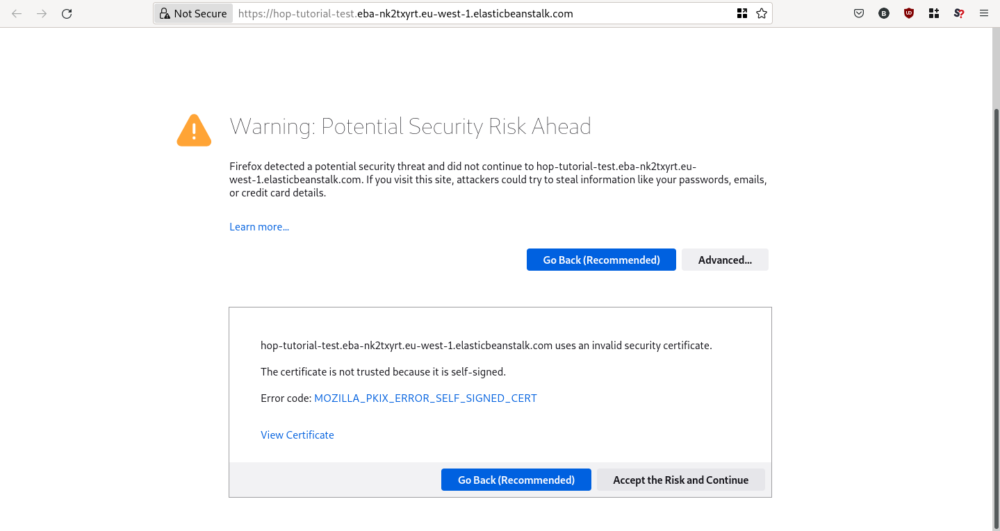

Run a HOP application on AWS
============================

Introduction
------------

In this tutorial you will bootstrap a basic HOP project with the
following features:

* `Duct Framework`_ based backend.
* `Reactive`_ ClojureScript front-end.
* Infrastructure provisioning in the Amazon Web Services deployment target.
* CI/CD integration with `GitHub Actions`_.

.. _Reactive: https://github.com/reagent-project/reagent
.. _Duct Framework: https://github.com/duct-framework/duct
.. _Amazon Web Services: https://aws.amazon.com/
.. _GitHub Actions: https://docs.github.com/en/actions

.. note::

   The HOP Command Line Interface tool (HOP CLI, from here on)
   provides more bootstrapping features, but this tutorial will focus
   in a bare minimum installation.

Prerequisites
-------------

Having the HOP CLI installed, as explained in the
:doc:`/get-started/installation/main` tutorial, is enough for
bootstrapping a new HOP project. But in order to run the generated
project locally on your machine, you will need some additional tools:

* `Docker <https://www.docker.com/>`_
* `Docker Compose <https://docs.docker.com/compose/>`_
* `AWS Vault <https://github.com/99designs/aws-vault>`_

Apart from the software requirements, you will also need an Amazon Web
Services account with administrator credentials, in order to create the
infrastructure needed.

Install Docker
++++++++++++++

As of this writing, HOP projects require Docker version 18.09 or
later. You can check if you have Docker already installed, and that it
is a supported version, by running the following command in a
terminal:

.. code-block:: console

   $ docker --version
   Docker version 18.09.1, build 4c52b90

If you do not have Docker installed, or if it is an older version than
the ones supported, you can install a supported version on your
operating system of choice, by following the instructions in the
`Docker installation documentation`_.

.. _Docker installation documentation: https://docs.docker.com/engine/install/

Once you have installed (or upgraded) Docker, you can check that it is
correctly installed by running the following command:

.. code-block:: console

   $ docker run --rm hello-world

   Hello from Docker!
   This message shows that your installation appears to be working correctly.

   [... more text appears here ...]

   For more examples and ideas, visit:
   https://docs.docker.com/get-started/

.. note::

   If you get an error about not having permission to connect to the
   Docker daemon socket, check the `Docker post-installation steps
   documentation`_:

.. _Docker post-installation steps documentation: https://docs.docker.com/engine/install/linux-postinstall/

You can also check that you have a supported version by re-running the
command you used before:

.. code-block:: console

   $ docker --version
   Docker version 18.09.1, build 4c52b90

Install Docker Compose
++++++++++++++++++++++

As of this writing, HOP projects require Docker Compose version 1.27.0
or later.

You can check if you have Docker Compose already installed, with a
supported version, by running the following command:

.. code-block:: console

   $ docker-compose --version
   docker-compose version 1.27.0, build 980ec85b

If you do not have Docker Compose installed, or if it is an older
version than the ones supported, you can install a supported version
on your operating system of choice, by following the instructions in
the `Docker Compose installation documentation`_.

.. _`Docker Compose installation documentation`: https://docs.docker.com/compose/install/

Once you have installed (or upgraded) Docker Compose, you can check
that it is correctly installed, and using a supported version, by
running the following command in a terminal:

.. code-block:: console

   $ docker-compose --version
   docker-compose version 1.27.0, build 980ec85b

Install AWS Vault
+++++++++++++++++

As of this writing, no specific version of AWS Vault is required, but
the latest available stable version is recommended.

To install it in your operating system of choice, please refer to the
`AWS Vault documentation`_.

.. _AWS Vault documentation: https://github.com/99designs/aws-vault#installing

.. note::

   If you install AWS Vault by downloading an executable binary from
   GitHub Releases, do not forget to rename the downloaded file to
   ``aws-vault``.

   Also, if your operating system uses permissions to decide whether a
   file can be executed or not (e.g., Linux or macOS), make sure you set
   the executable permission to the ``aws-vault`` file.

Once you have installed AWS Vault, you can check that it is installed
correctly by running the following command:

.. code-block:: console

   $ aws-vault --version
   v6.6.1

Prepare AWS credentials
-----------------------

The HOP CLI will automatically provision the infrastructure needed to
run the HOP project using `AWS Cloudformation`_. In order to do that,
you will need an existing AWS account (an IAM User) with administrator
access.

.. warning::

   **Do not** use the AWS root account user! `Create a new IAM User`_
   and give it administrator access instead.

That IAM User (the administrator user, from here on) will need
security credentials in the form of an Access Key. If the
administrator user does not have an Access Key yet, you can `create an
Access Key`_ from the AWS Console.

.. _AWS Cloudformation: https://aws.amazon.com/cloudformation/
.. _Create a new IAM User: https://docs.aws.amazon.com/IAM/latest/UserGuide/id_users_create.html
.. _create an Access Key: https://docs.aws.amazon.com/IAM/latest/UserGuide/id_credentials_access-keys.html#Using_CreateAccessKey

Although it is not mandatory, we strongly recommend storing the
administrator user credentials using AWS Vault
[#AdminAwsVaultCreds]_. Once you have the credentials, you can store
them in AWS Vault using the following command. The command assumes
that you will configure the "aws-vault prefix" configuration setting
as indicated below. If you configure a different prefix, make sure to
adjust this command to use the right one:

.. code-block:: console

   $ aws-vault add --add-config hop/hop-tutorial-admin

The tool will ask you for the administrator user AWS Access Key Id,
and its corresponding AWS Secret Access Key. Once you enter them, the
setup will be done.

.. note::

   If you get an error saying:

   ``aws-vault: error: Specified keyring backend not available, try --help``

   you are probably running AWS Vault in a system with no graphical
   environment. In that case, for this tutorial, you can use the
   ``AWS_VAULT_BACKEND`` environment variable and specify the ``file``
   backend type. That backend will ask you for a passphrase and store
   the credentials in an encrypted file on disk.

   See `aws-vault Backends documentation`_ for additional details and,
   as suggested, run:

   .. code-block:: console

      $ aws-vault add --help

   for additional available options.

   .. _`aws-vault Backends documentation`: https://github.com/99designs/aws-vault/blob/master/USAGE.md#backends

Configure the project settings
------------------------------

The HOP CLI allows the user to configure certain characteristics of
the project to be generated and provisioned in AWS. That configuration
is specified using a settings file. This tutorial uses the web-based
Settings Editor for creating and editing that file. If you would like
to edit the settings manually please refer to
:doc:`/get-started/run-hop-application-on-aws/appendix/edit-settings-file-manually`.

First launch the HOP CLI Settings Editor by running the following command:

.. code-block:: console

   $ hop bootstrap open-settings-editor
   Settings Editor running at http://localhost:8090

Now open the URL in a web browser and you will see the Settings
Editor's home-page. The first step is to select the HOP profiles. For
this tutorial we will select the following: Core, Frontend, Deploy to
Amazon Web Services and CI/CD.

Now hit next to configure the rest of the project settings.

In order to make this tutorial as simple as possible edit the
following configuration options:

* ``project`` → ``name``: We will set the project name to
  ``hop-tutorial``.
* ``project`` → ``profiles`` → ``aws`` → ``aws-vault`` →
  ``profile-prefix``: We will set the aws-vault profile to ``hop``. In
  the general case, you may want to use a prefix that identifies the
  project customer, or the AWS account where you will deploy the
  project, etc.
* ``deployment-target`` → ``aws`` → ``account`` → ``region``: The
  AWS region where you want to create the project resources. Change to
  your desired region. So far the HOP CLI has been mainly tested on
  the ``eu-west-1`` region. So we recommend you to use that region in
  order to ensure that all the services required by HOP application
  will be available [#UsingOtherAWSRegion]_.

Once you are done export the settings by clicking the "Export
settings" button. The browser will download a ``settings.edn`` file
that you will use in the next steps.

.. note::

   Make sure that the AWS region you configure is enabled in your AWS
   account. Not all the regions are enabled by default.

   Also, make sure that the AWS region you configure has the AWS
   Elastic Beanstalk service available. At the time of this writing,
   some of them (e.g., ``eu-south-2``) do not have it available. You
   can check the list of available regions at `AWS Elastic Beanstalk
   endpoints and quotas`_.

.. _`AWS Elastic Beanstalk endpoints and quotas`:
   https://docs.aws.amazon.com/general/latest/gr/elasticbeanstalk.html

.. warning::

   If you already have an AWS account with existing resources, please
   refer to
   :doc:`/get-started/run-hop-application-on-aws/appendix/existing-aws-account-settings`
   document for further considerations.

.. note::

   If this is the second time you are following this tutorial, some of
   the AWS resources created the first time you run the tutorial will
   still exist. The HOP CLI does not delete any AWS resources, to
   avoid deleting resources that may be in use. The HOP CLI does not
   overwrite any existing resource either, for the same reason.

   This means you will need to delete those AWS resources manually
   yourself. Refer to :doc:`/how-to/delete-aws-resources/main` for
   additional details.

.. _run-hop-application-on-aws_run-bootstrap-command:

Run the bootstrap command
-------------------------

..  note::

    Make sure that the clock of the machine where you run the
    following commands is correctly synchronized. The AWS services
    APIs used by the HOP CLI perform signature validation. And those
    signatures include the local time of the machine. If that local
    time is off by more than a certain threshold, the requests are
    denied.

Once you are happy with the selected configuration, you can bootstrap
the project by running the following command, where you need to
substitute ``your-aws-region`` by the AWS region you configured in
the previous step.

.. code-block:: console

   $ aws-vault exec --no-session --region your-aws-region hop/hop-tutorial-admin -- hop bootstrap new-project --settings-file-path hop-tutorial-settings.edn --target-project-dir hop-tutorial-project

You are telling ``aws-vault`` to run the ``hop bootstrap``
command, with the ``hop/hop-tutorial-admin`` credentials that you
stored in the vault in a previous step.

Bootstrapping the project will take several minutes (mostly because of
the AWS infrastructure provisioning). The tool will keep you informed about
each step that it performs. Those steps are:

* AWS infrastructure provisioning:

  * Account resources: Creates AWS resources that will be shared
    between multiple HOP projects.
  * Project resources: Creates AWS resources that will be shared
    between the different environments (test, production, etc.)
    inside the ``hop-tutorial`` project.
  * Dev environment resources: Creates the AWS resources needed for
    local development on your machine.
  * Test environment resources: Creates the AWS resources for
    deploying and running the test environment.

* Project files creation: Creates the local project files in the
  ``hop-tutorial-project`` folder.

* Post-installation steps: If required, the tool will print additional
  steps that have to be performed manually after the bootstrap process
  has been completed.

  Certain operations of the bootstrap process cannot be easily and
  securely automated. So the tool will print the steps that have to be
  performed manually. It is important not to lose the output of these
  post-installation steps until you have performed them all. Or to
  save that output in a secure place, because the output includes
  security credentials.

  The post-installation steps output includes all the details about
  what to do, but we will describe them here too. Nevertheless, you
  will still need to pay attention to `your` post-installation steps
  output, to get the actual credentials generated by the bootstrap
  process.

Configure the local project credentials
---------------------------------------

First you will have to add the credentials for the AWS user used for
local development. This user will be shared among all the HOP projects
you run on your system. So this step will only have to be performed
the first time you bootstrap a HOP project.

.. code-block:: console

   $ aws-vault add --add-config hop/hop-local-dev

and provide the Access Key ID and Secret Access Key values provided in
the post-installation steps output.

Then you will have to configure the AWS IAM role used for running the
``hop-tutorial`` project. That role contains the specific permissions
for interacting with the resources in the dev environment for the
``hop-tutorial`` project. You will have to edit the AWS client
configuration file (usually in ``~/.aws/config``, but see `AWS CLI
Configuration and credential file settings`_), and add the lines
provided in the post-installation steps output. It should look like
the following:

.. _`AWS CLI Configuration and credential file settings`:
   https://docs.aws.amazon.com/cli/latest/userguide/cli-configure-files.html

.. code-block:: ini

   # Example configuration
   [profile hop/hop-tutorial-dev-env]
   source_profile = hop/hop-local-dev
   role_arn = arn:aws:iam::your-aws-account-id:role/hop-tutorial-dev-role
   region = your-aws-region

The tool will also print the Access Key ID and Secret Access Key for
the CI/CD user. Take note of them, as you will need them in a later
step to configure GitHub Actions.

Initialize the Git repository
-----------------------------

Before you make any changes to the code, we suggest to initialize the
git repository with the project files. That way you will easily track
any changes that you make to the files generated by the HOP CLI.

.. code-block:: console

   $ cd hop-tutorial-project
   $ git init --initial-branch=main

.. note::

   If you have an older version of git that does not support the
   ``--initial-branch`` option, you can run the following commands
   instead:

   .. code-block:: console

      $ git init
      $ echo 'ref: refs/heads/main' > .git/HEAD

As you can see, we are setting the git branch to ``main``, which is
the default value in the settings file. This setting is configurable
(under ``project`` → ``profiles`` → ``ci`` → ``continuous-deployment``
→ ``git`` → ``deployment-branch.name``) and you can set it to any
other desired value in the settings file.

But it is important that the branch used in the above command aligns
with the one configured in the settings file. Because the branch name
configured in the settings file will be the only one used as the
deployment branch by the CI/CD pipeline.

Now you can make the initial commit:

.. code-block:: console

   $ git add .
   $ git commit -m "Initial commit"

Run the project in the local development environment
----------------------------------------------------

At this point you are ready to run the project in the local
development environment. For that, simply run the ``start-dev.sh``
script. In short, the script will take care of three things:

* Selecting the relevant `docker-compose` files used in the
  local development environment, and starting the Docker containers.
* Making sure that the environment is started in a clean state.
* Running the project with the ``hop/hop-tutorial-dev-env``
  credentials, as they are needed to access the development
  environment AWS resources.

When you run the ``start-dev.sh`` script, you will get all the log
entries from the Docker containers:

.. code-block:: console

   $ ./start-dev.sh
   ...
   ... lots of additional output  ...
   ...
   app_1    | 2022-12-29T17:48:33.808145053Z nREPL server started on port 4001 on host 0.0.0.0 - nrepl://0.0.0.0:4001

You can see that the script started two Docker containers: the HOP web
application and a `Nginx`_ reverse proxy. The final log line, when
both containers have started and the application container is up and
running, should say something like ``nREPL server started on port 4001
on host 0.0.0.0``.

You can keep the script running and displaying new container log
entries as they are produced, or you can stop the script
execution. Stopping the script at this point does not have any
unintended side effects like stopping the Docker containers, as they
are started in the background. It simply stops displaying new
container log entries.

.. _Nginx: https://nginx.org

The application container is up and running, but that does not mean
that the application web server is up and running too. You need to
start it manually from the REPL. In the application logs you should
see that the REPL is running on the port ``4001``.

Using your favorite Clojure(Script) IDE connect to the REPL. Some
IDE's call this type of REPL external or remote.

Once connected, you can load up the Duct development environment:

.. code-block:: clojure

   user=> (dev)
   "WARNING: abs already refers to: #'clojure.core/abs in namespace: medley.core, being replaced by: #'medley.core/abs"
   "WARNING: update-keys already refers to: #'clojure.core/update-keys in namespace: io.aviso.exception, being replaced by: #'io.aviso.exception/update-keys"
   :loaded
   dev=>

And then start the application itself:

.. code-block:: clojure

   dev=> (go)
   :duct.server.http.jetty/starting-server {:port 3000}
   "WARNING: abs already refers to: #'clojure.core/abs in namespace: day8.re-frame-10x.inlined-deps.garden.v1v3v10.garden.color, being replaced by: #'day8.re-frame-10x.inlined-deps.garden.v1v3v10.garden.color/abs"
   "JavaScript environment will not launch automatically when :open-url is false"
   :initiated
   dev=>

At this point the application's web server will be up and running, and
you should be able to connect to it from a web browser. The ``(go)``
command outputted that the web server is listening on port
``3000``. But you should connect through the Nginx reverse proxy that
is listening on port ``80`` instead.

Open a web browser and go to ``http://localhost``. You should see
HOP's welcome page there.

.. image:: img/local-running-hop-app.png

We will not make any change to the code now, so once you check that
the application is running, you can stop the whole development
environment by executing the following script:

.. code-block:: console

   $ ./stop-dev.sh

Create and configure the external GitHub repository
---------------------------------------------------

In this tutorial we will use GitHub for hosting the code, and GitHub
Actions for the CI/CD pipeline. Both services are free of charge for
public repositories. You can follow GitHub's `official documentation`_
to create the repository.

Once you create the repository, GitHub will display a set of
instructions to do your first commit and push. You need to ignore them
however. You just need to configure the secrets used to deploy the
HOP application to AWS, by following these steps:

1. Open the repository settings.
2. In the sidebar, go to Security → Secrets → Actions.
3. You will need to configure three secrets here, with the values of
   the CI user provided in the post installation steps output.

   * ``AWS_ACCESS_KEY_ID``
   * ``AWS_SECRET_ACCESS_KEY``
   * ``AWS_DEFAULT_REGION``

.. image:: img/github-secrets.png

Then configure the local git repository to point to GitHub's remote
repository by execute the following command:

.. code-block:: console

   $ git remote add origin <github-repository-url>

And you can finally push your initial commit:

.. code-block:: console

   $ git push -u origin main

.. _official documentation: https://docs.github.com/en/repositories/creating-and-managing-repositories/creating-a-new-repository

Deploy application to test environment
--------------------------------------

The first push to the GitHub repository will not trigger the CI/CD
pipeline. So you will have to make a second commit to proceed.

Open the ``app/src/hop_tutorial/client/landing.cljs`` file using your
favorite IDE and change the ``"Your application is up and running!"``
message to ``"Your application is up and running on AWS!!!!!!"``.

Now commit and push the change to GitHub:

.. code-block:: console

   $ git add app/src/hop_tutorial/client/landing.cljs
   $ git commit -m "Change landing message"
   $ git push

This second commit will start the CI/CD pipeline, which will perform
the following steps:

1. Run linting and formatting checks against the ``sh``, ``yaml``, ``json``
   and ``Dockerfile`` files.
2. Run linting and formatting checks against the Clojure(Script) project files,
   using ``clj-kondo``, ``eastwood`` and ``cljfmt``.
3. Execute the project unit and integration tests.
4. Deploy the application to AWS Elastic Beanstalk test
   environment. In order to do that, the Docker production image is
   built and uploaded to AWS ECR first.

Once the pipeline has run successfully, the application should be
already deployed to AWS. You can check that the deployment was
successfully done from the the AWS Console. Log in into your AWS
Account and go to the AWS Elastic Beanstalk service.

Now choose the ``hop-tutorial-test`` environment under the ``hop-tutorial``
application.

If the deployment was success, you will see a green check in the
Health section. It might happen that when you open the page the
application is still being deployed to the actual EC2 instance where
it will run. So do not worry if you see a red or yellow health check
for some time. It takes from one to three minutes for the whole
deployment process to be completed, and the application being up and
running and ready to serve requests.

If something goes wrong the errors will be displayed in the "Recent
events" section, just below the health check section.

Accessing the web application in the test environment
-----------------------------------------------------

Under the AWS Elastic Beanstalk environment name you will see the
application's publicly available URL.

When accessing it for the first time you will get a warning about the
website SSL certificate being invalid. That is completely expected, as
the web application is using a self-signed SSL certificate created by
the HOP CLI.

You can tell the browser to ignore the warning until you setup a real
SSL certificate [#SetupSSLCertificate]_.

There you have your new HOP-based application!

.. rubric:: Footnotes

.. [#AdminAwsVaultCreds] The tool provides secure storage for AWS
   credentials for the local development environment. The tool is also
   used in later steps for running the project locally,

.. [#SettingsFileStructure] The file uses the `EDN`_ format, and it
   needs to conform to a HOP-specific `Malli Schema`_. Its structure
   is loosely based on GNU Emacs customization settings.

.. [#UsingOtherAWSRegion] If you use any other AWS region and find any
   problem, please open an issue in the `HOP CLI issue tracker`_.

.. [#SetupSSLCertificate] You will need to provision the SSL
   certificate in AWS Certificate Manager. And then configure the AWS
   Load Balancer used by the test environment, to use that new
   certificate.

.. _`EDN`: https://github.com/edn-format/edn
.. _`Malli Schema`: https://github.com/metosin/malli/
.. _`HOP CLI issue tracker`: https://github.com/gethop-dev/hop-cli/issues/
