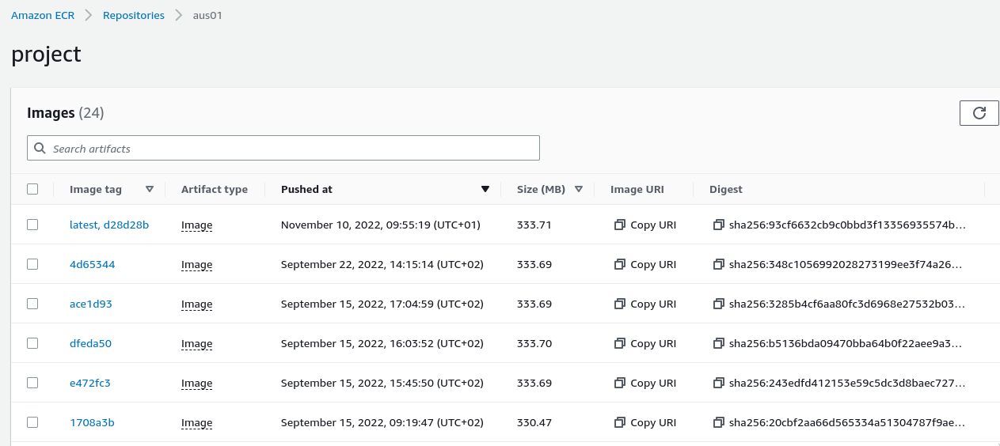
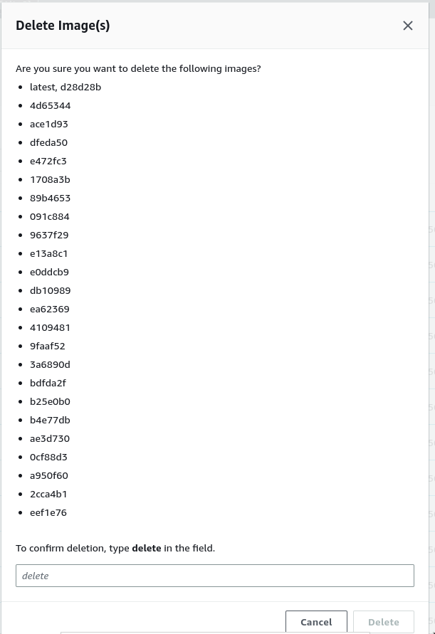

How to delete AWS resources created by HOP
==========================================

This guide shows how to delete all the AWS resources created by the
HOP bootstrapping tool. Most of the resources will be deleted in batch
by Cloudformation. But some require manual steps due to the accidental
data loss protection mechanism that Cloudformation enforces.

Some of the following steps depend on each other, so make sure you
follow them in the described order.

Disable the delete protection to the RDS DB
-------------------------------------------

The database will be deleted by Cloudformation, but the delete
protection has to be disabled first.

Go to the RDS Console and find the HOP database. HOP uses one DB
instance per environment(testing and production), so be careful and
choose the one you want to delete. Then click on "Modify".

.. image:: img/rds-instance-list.png

Find the "Enable deletion protection" checkbox (usually at the end of
the page) and uncheck it. Then click on the "Continue" button.

.. image:: img/rds-delete-protection-checkbox.png

RDS will ask you when the change should be applied. Under "Schedule
modifications" select "Apply immediately" and click on "Modify DB
instance".

.. image:: img/rds-schedule-modifications.png

Delete the Cognito User Pool
----------------------------

Cloudformation will not delete the Cognito User Pool, so it has to be
deleted manually.

Go to the Cognito Console and find the HOP User Pool. HOP creates one
User Pool per environment(development, testing and production), so be
careful and choose the one you want to delete. Then click on "Delete".

.. image:: img/cognito-pool-list.png

Cognito will ask you to retype the name of the User Pool to ensure you
are deleting the expected one.

.. image:: img/cognito-delete-confirmation.png

Cleanup ECR Docker images
-------------------------

The ECR repository is shared among the testing and production
environments. So you should only perform this step if you are
completly deleting a HOP project. Skip this step if you just want to
delete one environment.

Go to the ECR HOP project repository in the AWS Console.

Select and delete all the images.

Delete environment variables in SSM Parameter Store
---------------------------------------------------

The environment variables stored in SSM Parameter Store should be
deleted manually too. They can be deleted manually from the AWS
Console, but using the HOP Command Line Tool is more convenient.

The ``aws env-vars sync`` command is used to sync the environment
variables between a file in disk and the variables stored in the
Parameter Store. For deleting all the stored environment variables in
SSM Parameter Store you can just provide an empty file to the command.

Create the empty file:

.. code-block:: console

   $: touch empty-variables.env

And then use the HOP Command Line Tool to sync the Parameter Store
with the empty file:

.. code-block:: console

   $: bb hop-cli.jar aws env-vars sync
      --project-name <value>
      --environment <value>
      --file empty-variables.env
      --kms-key-alias <value>

The command must be repeated for each environment you would like to
delete.

You can find more information about the command in the
:doc:`/reference/hop-cli/main` document.

Delete the Cloudformation stacks
--------------------------------

At this point you are ready to delete the Cloudformation stacks. First
go to the Cloudformation Console.

To find the stacks more easily uncheck the ``View nested`` filter that
is placed next to the search bar.

.. image:: img/cloudformation-list.png

HOP uses four different stacks for creating it's resources:

* Account stack:

  * This stack is shared between all your HOP projects, so it only
    should be deleted if you want to completly remove HOP from your AWS
    account.
  * The default name for the stack is ``hop-account``, but you might
    have renamed it in the ``settings.edn`` file.
  * Delete the rest of the HOP stacks before attemping to delete the
    Account stack.

* Project stack:

  * The stack should only be deleted if you want to completly remove a
    HOP project from your AWS account.
  * The default name for the stack is ``hop-project``, but you might
    have renamed it in the ``settings.edn`` file.
  * Delete the environment stacks before deleting the Project stack.

* Development environment stack:

  * The stack should be deleted if you want to remove the development
    environment.
  * The default name for the stack is ``hop-project-dev`` but you
    might have renamed it in the ``settings.edn`` file.

* Testing environment stack:

  * The stack should be deleted if you want to remove the testing
    environment.
  * The default name for the stack is ``hop-project-test`` but you
    might have renamed it in the ``settings.edn`` file.

* Production environment stack:

  * The stack should be deleted if you want to remove the production
    environment.
  * The default name for the stack is ``hop-project-prod`` but you
    might have renamed it in the ``settings.edn`` file.

For each stack Cloudformation will ask you to confirm that you really
want to delete the stack.

.. image:: img/cloudformation-delete-confirmation.png

Take into account that deleting the stacks might take several minutes.

.. note::

   Make sure you only delete the stacks that you expect. Even if you
   have never used Cloudformation explicitly, there are certain AWS
   services (e.g., Elastic Beanstalk) that use Cloudformation
   underneath and create stacks on your behalf.

Delete the self-signed certificate
---------------------------------

The HOP Bootstrapping Tool creates a self-signed SSL certificate. In
order to delete it go to the Certificate Manager console.

Find The certificate which ``Domain name`` is ``self-signed.invalid``
and delete it.

.. image:: img/certificate-manager-list.png

Delete the RDS DB snapshot
--------------------------

Cloudformation will create a database snapshot before deleting the
instance. If you are not interested in keeping it, you can remove it
from the RDS Console.

In the RDS sidebar go to ``Snapshots``, and find and delete the snapshot.
