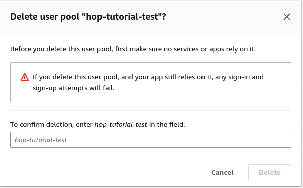
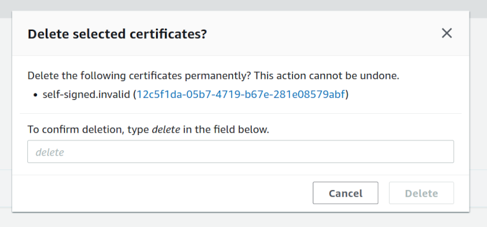

How to delete AWS resources created by HOP
==========================================

This guide shows how to delete all the AWS resources created by the
HOP CLI. Most of the resources will be deleted in batch
by Cloudformation. But some require manual steps due to the accidental
data loss protection mechanism that Cloudformation enforces.

Some of the following steps depend on each other, so make sure you
follow them in the described order.

Disable the delete protection to the RDS DB instance
----------------------------------------------------

The DB instance will be deleted by Cloudformation, but the delete
protection has to be disabled first.

.. note::

   If you did not enable the ``:persistence-sql`` profile in the
   settings file, no RDS DB instance was created. So you
   may skip this step.

Go to the RDS Console and find the HOP database instance. HOP uses one
database instance per provisioned environment (testing and
production), so be careful and choose the one you want to delete. Then
click on "Modify".

.. image:: img/rds-instance-list.png

Find the "Enable deletion protection" checkbox (usually at the end of
the page) and uncheck it. Then click on the "Continue" button.

.. image:: img/rds-delete-protection-checkbox.png

RDS will ask you when the change should be applied. Under "Schedule
modifications" select "Apply immediately" and click on "Modify DB
instance".

Delete the Cognito User Pool
----------------------------

Cloudformation will not delete the Cognito User Pool, so it has to be
deleted manually.

.. note::

   If you did not enable the ``:auth-cognito`` profile in the
   settings file, no Cognito User Pool was created. So you
   may skip this step.

Go to the Cognito Console, select "Manage User Pools" and then find
the HOP User Pool. HOP creates one User Pool per environment
(development, testing and production), so be careful and choose the
one you want to delete. Then click on "Delete".

Cognito will ask you to retype the name of the User Pool to ensure you
are deleting the expected one.

Cleanup AWS Elastic Container Registry repository
-------------------------------------------------

The AWS Elastic Container Registry (ECR) HOP project repository is
shared among the testing and production environments. So you should
only perform this step if you are completely deleting a HOP
project. Skip this step if you just want to delete one environment.

Go to the ECR console and find the HOP project repository. Select it
and click on "Delete". ECR will ask you to type `delete` to confirm
the repository deletion and all the Docker images contained in it:

Delete environment variables in SSM Parameter Store
---------------------------------------------------

The environment variables stored in the SSM Parameter Store must be
deleted manually too. They can be deleted manually from the AWS
Console, but using the HOP CLI is more convenient.

The ``aws env-vars sync`` sub-command is used to sync the environment
variables between a local file on disk and the variables stored in
the SSM Parameter Store. In order to delete all the environment
variables, you can just provide an empty local file to the command.

Create the empty file ``empty-variables.env`` first:

.. code-block:: console

   $ cat /dev/null > empty-variables.env

and then use the HOP CLI to sync the local empty file with the SSM
Parameter Store:

.. code-block:: console

   $ aws-vault exec --region <aws-region> --no-session hop/hop-tutorial-admin -- hop aws env-vars sync --project-name <hop-project-name> --environment <hop-project-eb-environment> --file empty-variables.env --kms-key-alias <hop-project-kms-alias>

where:

* ``<aws-region>`` is value of ``cloud-provider`` → ``aws`` →
  ``account`` → ``region.value`` in the settings file for the HOP
  project.
* ``<hop-project-name>`` is the value of ``project`` →
  ``name.value`` in the settings file.
* ``<hop-project-eb-environment>`` is either ``test`` or ``prod``
* ``<hop-project-kms-alias>`` is one of the two following values:

  * ``cloud-provider`` → ``aws`` → ``environment`` → ``test`` →
    ``kms`` → ``key-alias.value``.
  * ``cloud-provider`` → ``aws`` → ``environment`` → ``prod`` →
    ``kms`` → ``key-alias.value``.

  depending on the value of ``<hop-project-eb-environment>``.

When you execute the command, it will output which environment
variables were created, which ones were updated and which ones were
deleted:

.. code-block:: console

   $ aws-vault exec --region <aws-region> --no-session hop/hop-tutorial-admin -- hop aws env-vars sync --project-name <hop-project-name> --environment <hop-project-eb-environment> --file empty-variables.env --kms-key-alias <hop-project-kms-alias>
   {:success? true,
    :sync-details
    {:to-update [],
     :to-create [],
     :to-delete
     [{:value "4096m", :name "MEMORY_LIMIT_APP"}
      {:value "128m", :name "MEMORY_LIMIT_PROXY"}]}}

You can find more information about the command in the
:doc:`/reference/hop-cli/main` document.

Delete the Cloudformation stacks
--------------------------------

At this point you are ready to delete the Cloudformation stacks. First
go to the Cloudformation Console.

To find the stacks more easily, uncheck the ``View nested`` filter
that is placed next to the search bar.

HOP uses up to five different stacks for creating it's resources:

* Development environment stack:

  * This stack should be deleted if you want to remove AWS resources
    used by the local development environment, for the given HOP
    project.
  * The default name for the stack is ``hop-project-dev``, but you
    might have renamed it in the settings file.

* Testing environment stack:

  * This stack should be deleted if you want to remove the testing
    environment, for the given HOP project.
  * The default name for the stack is ``hop-project-test``, but you
    might have renamed it in the settings file.

* Production environment stack:

  * This stack should be deleted if you want to remove the production
    environment, for the given HOP project.
  * The default name for the stack is ``hop-project-prod``, but you
    might have renamed it in the settings file.

* Project stack:

  * This stack is shared among all the environments of a given HOP
    project.
  * So this stack should only be deleted if you want to completely
    remove a HOP project from your AWS account.
  * The default name for the stack is ``hop-project``, but you might
    have renamed it in the settings file.
  * Make sure you have deleted all the project environment stacks
    before deleting the Project stack.

* Account stack:

  * This stack is shared among all your HOP projects, so it should
    only be deleted if you want to completely remove HOP from your AWS
    account.
  * The default name for the stack is ``hop-account``, but you might
    have renamed it in the settings file.
  * Make sure you have deleted the rest of the HOP stacks (for all HOP
    projects) before attempting to delete the Account stack.

For each stack, Cloudformation will ask you to confirm that you really
want to delete the stack.

.. image:: img/cloudformation-delete-confirmation.png

Take into account that deleting each stack might take several minutes.

.. note::

   Make sure you wait until a given stack is completely deleted before
   attempting to delete a stack that depends on it. E.g., wait until
   the Development environment stack is fully deleted before
   attempting to delete the Project Stack.

   Otherwise you may get Cloudformation errors saying that some
   depending resources could not be deleted, and the stack dependent
   stack will not be deleted.

.. warning::

   Make sure you only delete the stacks that you expect. Even if you
   have never used Cloudformation explicitly, there are certain AWS
   services (e.g., AWS Elastic Beanstalk) that use Cloudformation
   underneath and create stacks on your behalf.

Delete the self-signed certificate from Certificate Manager
-----------------------------------------------------------

The HOP CLI creates a self-signed SSL certificate and imports it into
the Certificate Manager. In order to delete it go to the Certificate
Manager console.

Find the certificate whose ``Domain name`` is ``self-signed.invalid``
and delete it.

.. image:: img/certificate-manager-list.png

The Certificate Manager will ask you to confirm that you really
want to delete the certificate.

Delete the RDS DB instance snapshot
-----------------------------------

Cloudformation will create a database snapshot before deleting the RDS
DB instance. If you are not interested in keeping it, you can remove
it from the RDS Console.

.. note::

   If you did not enable the ``:persistence-sql`` profile in the
   settings file, no DB instance snapshots was created. So
   you may skip this step.

In the RDS console sidebar go to ``Snapshots``, and find and delete
the snapshot.
