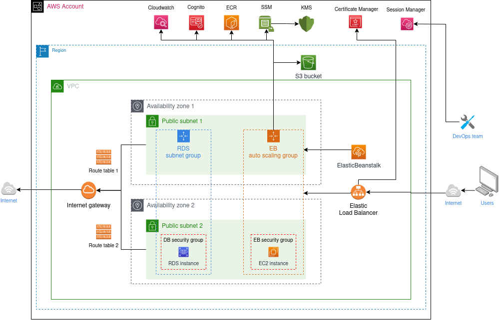

AWS infrastructure reference
============================

When the AWS cloud provider is selected, the HOP CLI will provision
all the infrastructure needed for deploying the platform.

Cloudformation
--------------

For provisioning the infrastructure `AWS Cloudformation`_ is used. The
stack definitions can be found in the `HOP CLI's GitHub repository`_:

.. _`HOP CLI's GitHub repository`: https://github.com/gethop-dev/hop-cli

* `Account stack`_: provisioning of resources that can be shared
  among different HOP projects.
* `Project stack`_: provisioning of resources that are project-specific.
* `Local environment stack`_: provisioning of resources used when developing locally.
* `Cloud environment stack`_: provisioning of resources used in the
  testing and production environments. The stack is run once for each
  environment.

Provisioned architecture
------------------------

The following picture shows the general architecture of the
infrastructure provisioned by the tool.

When creating the production infrastructure the following resources
are shared with the testing environment:

* VPC, Subnets and networking-related resources.
* AWS Elastic Load Balancer.
* AWS Elastic Container Registry.

.. note::

   S3, RDS, Cloudwatch and Cognito resources are optional, and the
   user can choose to provision them or not in the settings file.

Security considerations
-----------------------

Inbound and Outbound traffic
~~~~~~~~~~~~~~~~~~~~~~~~~~~~

* The load balancer allows inbound HTTP traffic in port 80 and HTTPS
  in port 443.
* HTTP traffic is redirected to HTTPS in the load balancer.
* In order to access to the internal network (e.g., to connect to the
  RDS database instance from the local environment) `AWS Session
  Manager`_ must be used. No other inbound traffic is allowed.
* Traffic from the public subnets to the Internet is allowed through
  the Internet Gateway.

IAM groups, users and roles
~~~~~~~~~~~~~~~~~~~~~~~~~~~

The following section lists the different group, users and roles
created by the HOP CLI. The specific permissions attached to each
entity can be consulted in the `Cloudformation stack definitions`_.

IAM groups
++++++++++

* ``<resource-name-prefix>-ci``: group for the user(s) used to run
  Continuous Integration and Continuous Delivery pipelines.

IAM users
+++++++++

* ``<resource-name-prefix>-ci``: user for running the Continuous
  Integration and Continuous Delivery pipelines. It belongs to the
  ``<resource-name-prefix>-ci`` group.
* ``<resource-name-prefix>-local-dev``: user for assumming the
  development IAM role used in the development environment.

IAM roles
+++++++++

* ``<resource-name-prefix>-rds-monitoring-role``: role to allow the
  RDS instances to have enhanced monitoring.
* ``<resource-name-prefix>-aws-elasticbeanstalk-service-role``:
  service role for the AWS Elastic Beanstalk applications.
* ``<project-name>-dev-role``: role with access to the AWS resources
  used during local development. It will have more or less policies
  attached depending on the selected optional AWS services.
* ``<project-name>-<test/prod>-role``: role to give access to the AWS
  resources to the testing and production environment AWS Elastic
  Beanstalk instances. It will have more or less policies attached
  depending on the selected optional AWS services. One role for each
  environment is created.

.. _AWS Cloudformation: https://docs.aws.amazon.com/AWSCloudFormation/latest/UserGuide/Welcome.html
.. _Cloudformation stack definitions: https://github.com/gethop-dev/hop-cli/tree/main/resources/infrastructure/cloudformation-templates
.. _Account stack: https://github.com/gethop-dev/hop-cli/blob/main/resources/infrastructure/cloudformation-templates/account.yaml
.. _Project stack: https://github.com/gethop-dev/hop-cli/blob/main/resources/infrastructure/cloudformation-templates/project.yaml
.. _Local environment stack: https://github.com/gethop-dev/hop-cli/blob/main/resources/infrastructure/cloudformation-templates/local-environment.yaml
.. _Cloud environment stack: https://github.com/gethop-dev/hop-cli/blob/main/resources/infrastructure/cloudformation-templates/cloud-environment.yaml
.. _AWS Session Manager: https://docs.aws.amazon.com/systems-manager/latest/userguide/session-manager.html
